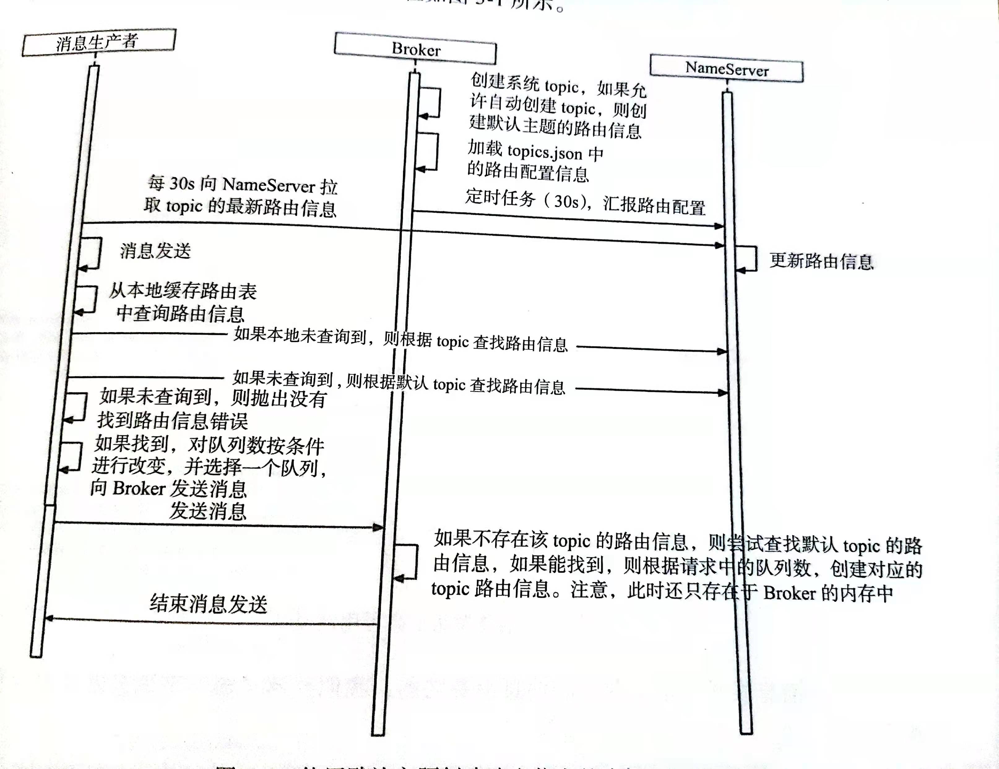
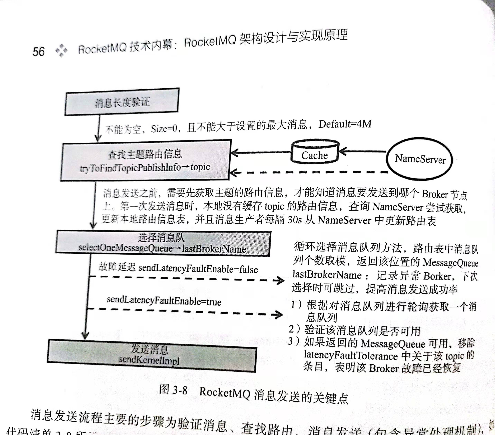

# RocketMQ消息发送Producer
## 概述
producer 在 rocketMq 扮演的角色是消息的发送过程，其实宏观上来讲其实就包括两大块，分别是消息的发送以及一堆定时任务。
producer 在发送消息过程中涉及到发送队列的选择（topic、broker、queue），所以只要在整个发送过程中理清楚这几者之间的关系，就能理解整个发送过程，当然其中包括 非严格顺序消息、顺序消息、事务消息。这里只讲非顺序消息、顺序消息，不包括事务消息。

RocketMQ 消息发送需要考虑以下几个问题：
1. 消息队列如何进行负载均衡
2. 消息发送如何实现高可用
3. 批量消息发送如何实现一致性

## producer的发送过程

rocketMq 发送时序图

rocketMq 发送消息过程由以下组成：组装消息 & 获取 topicPubInfo & 选择队列 & 发送消息。

### 组装消息

Message 的属性主要包括 topic、flag（RocketMQ 不做处理）、扩展属性、消息体。
消息长度不能为 0 且默认不允许超过最大长度 4M

### 获取路由信息
tryToFindTopicPublishInfo 是查找 topic 路由信息的方法。如果 Producer 中缓存了 topic 的路由信息，如果该路由信息中包含了消息队列，则直接返回路由信息，如果没有缓存或没有包含消息队列，则从 NameServer 查询该 topic 的路由信息。如果最终未找到路由信息，则抛出异常。

producer每隔30s自动与nameserver更新路由信息

#### 自动创建主题

1. client本地首先没有缓存对应topic的路由信息，然后先去nameserver去查找，nameserver中也没有此topic的路由信息，然后返回给client。
2. client接收到返回后再向nameserver请求topic为tbw102的路由信息。
3. 如果有broker设置了autocreateTopic，则broker在启动的时候会在topicManager中创建对应的topicconfig通过心跳发送给nameserver。namerserver会将其保存。
4. nameserver将之前保存的tbw102的路由信息返回给请求的client。client拿到了topic为tbw102的路由信息后返回，client根据返回的tbw102路由信息（里面包含所有设置了autocreateTopic为true的broker，默认每个broker会在client本地创建DefaultTopicQueueNums=4个读写队列选择，假设两个broker则会有8个队列让你选择）先缓存到本地的topicPublishInfoTable表中，key为此topic ，value为此topicRouteData，轮询选择一个队列进行发送。根据选择到的队列对应的broker发送该topic消息。
5. broker在接收到此消息后会在msgcheck方法中调用createTopicInSendMessageMethod方法创建topicConfig信息塞进topicConfigTable表中，然后就跟发送已经创建的topic的流程一样发送消息了。
6. 同时topicConfigTable会通过心跳将新的这个topicConfig信息发送给nameserver。nameserver接收到后会更新topic的路由信息，如果之前接收到消息的broker没有全部覆盖到，因为broker会30S向nameserver发送一次心跳，心跳包里包含topicconfig，覆盖到的broker会将自动创建好的topicconfig信息发送给nameserver，从而在nameserver那边接收到后会注册这个新的topic信息，因为消费者每30S也会到nameserver去更新本地的topicrouteinfo，请求发送到nameserver得到了之前覆盖到的broker发送的心跳包更新后的最新topic路由信息，那么未被覆盖的broker就永远不会加入到这个负载均衡了，就会造成负载均衡达不到预期了，即所有能自动创建topic的broker不能全部都参与进来。

### 选择消息队列

从TopicPublishInfo中获取所有messageQueueList后，选择messageQueue有两种方法：
1. 消息发送重试机制（默认）
   * 轮询的方法选取messageQueue，以进行负载均衡
   * 发送失败自动重试两次（只有同步方式？），并且每次重试都避免发送到上一次失败的broker的messageQueue中
2. 故障规避机制
   1. 轮询的方法选取messageQueue，以进行负载均衡
   2. 一次发送失败之后，会将失败的broker记录下来，一段时间内避免使用这个broker
故障规避机制开启的区别在于：不开启只会在一条消息的重试过程中规避失败的broker，开启之后会使得productor一段时间内的消息发送都不会选择该broker

### 发送消息
RocketMQ 支持 3 种消息发送方式：
1. 同步（sync）：producer 向 MQ 发送消息时，同步等待，直到消息服务器返回发送结果。
2. 异步（async）：producer 向 MQ 发送消息时，指定消息发送成功后的回调函数，然后调用消息发送 API 后，立即返回，producer 线程不阻塞，直到运行结束，producer 发送成功或失败的回调任务在一个新的线程中执行。
3. 单向（oneway）：producer 想 MQ 发送消息时，直接返回，不等待 MQ 的结果，也不注册回调函数。也就是只管发，不管发送是否成功。

## 参考博客
https://blog.csdn.net/shijinghan1126/article/details/107566198
https://www.jianshu.com/p/bbaf72d160ca
https://blog.csdn.net/yifouhu2947/article/details/87714047