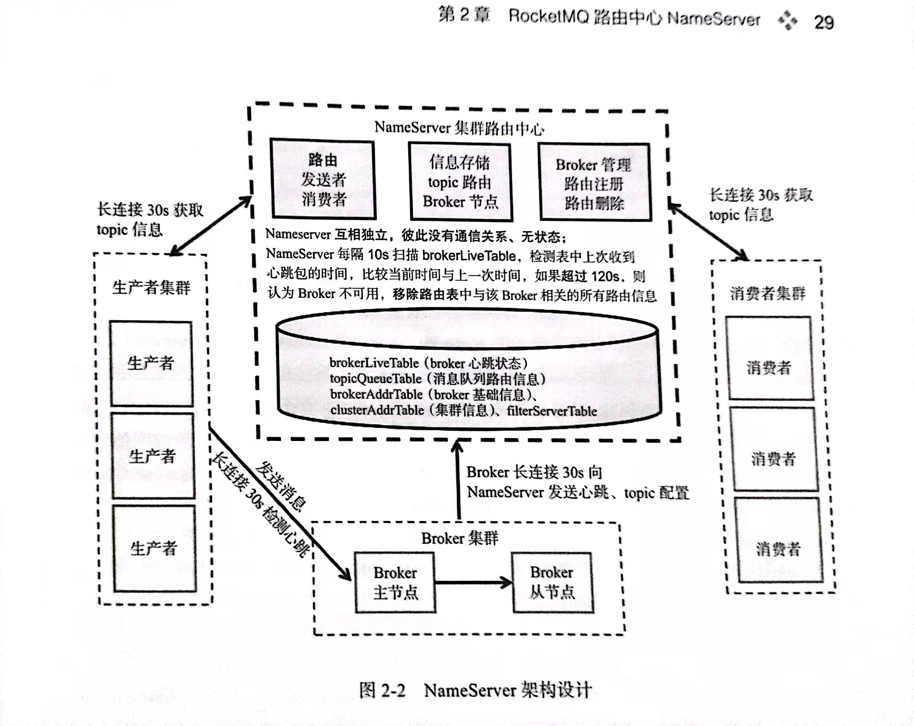

# RocketMQ路由中心NameServer
## NameServer 架构设计
RocketMQ 由 NameServer 来负责路由管理、服务注册、服务发现。
NameServer，很多时候称为命名发现服务，其在RocketMQ中起着中转承接的作用，是一个无状态的服务，多个NameServer之间不通信。任何Producer、Consumer、Broker与所有NameServer通信，向NameServer请求或者发送数据。而且都是单向的，Producer和Consumer请求数据，Broker发送数据。正是因为这种单向的通信，RocketMQ水平扩容变得很容易。

1. NameServer是一个几乎无状态节点，可集群部署，节点之间无任何信息同步。因此会出现不一致问题，但是顶多影响负载均衡
2. Broker分为Master与Slave，一个Master可以对应多个Slave，Broker 在启动时，会向所有的 NameServer 注册
3. 每个Broker与NameServer集群中的所有节点建立长连接，定时注册Topic信息到所有NameServer。
4. NameServer每隔十秒通过Broker时间戳检测是否宕机，如果发现 Broker 宕机，则从路由注册表中将其移除，但不会通知消息客户端
5. Producer与NameServer集群中的其中一个节点(随机选择)建立长连接，定期从NameServer取Topic路由信息，并向提供Topic服务的Master建立长连接，且定时向Master发送心跳。Producer完全无状态，可集群部署。 
6. Consumer与NameServer集群中的其中一个节点(随机选择)建立长连接，定期从NameServer取Topic路由信息，并向提供Topic服务的Master、Slave建立长连接，且定时向Master、Slave发送心跳。Consumer既可以从Master订阅消息，也可以从Slave订阅消息，订阅规则由Broker配置决定。

## NameServer 路由注册和故障剔除
### Broker 路由注册
RocketMQ 是通过 Broker 与 NameServer 之间的心跳功能实现的。Broker 启动时向集群中所有的 NameServer 发送心跳语句，每隔 30s 向集群中所有的 NameServer 发送心跳包，NameServer 收到心跳包时会更新 brokerLiveTable，如果连续 120s 没有收到心跳包，NameServer 将移除该 Broker 的路由信息，同时关闭 Socket 连接。
### 路由删除
Broker 每隔 30s 向 NameServer 发送一个心跳包，心跳包中包含 BrokerId, Broker 地址、Broker 所属集群名称、Broker 关联的 FilterServer 列表。

NameServer 会每隔 10s 扫描 brokerListTable 状态表，如果 BrokerLive 的 lastUpdateTimestamp 的时间距离当前时间超过 120s，则认为 broker 失效，移除该 broker，关闭与 broker 连接，并同时更新 topicQueueTable, brokerAddrTable, brokerLiveTable, filterServerTable、
### 路由发现
当 Topic 路由出现变化后，NameServer 不主动推送给客户端，而是由客户端定时拉取 Topic 最新的路由。

参考博客 https://blog.csdn.net/ever223/article/details/100547232