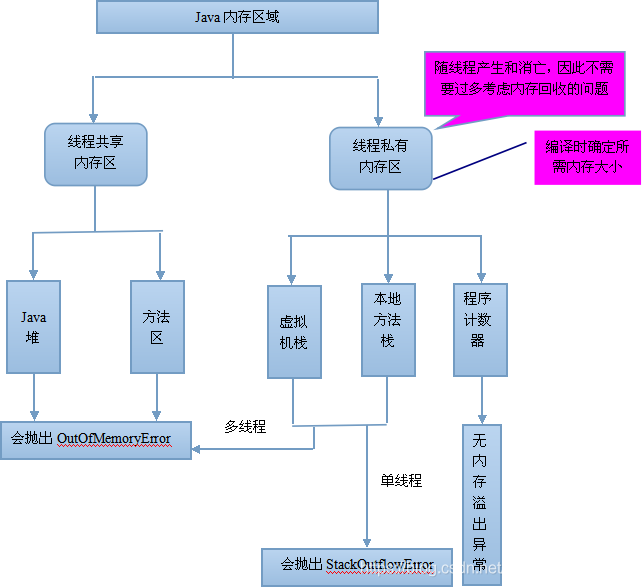

# java内存区域与内存溢出异常

## 运行时数据区域

### 程序计数器
   程序计数器是一块较小的内存空间，可以看作是当前线程所执行的字节码的行号指示器。线程私有
   当线程在执行一个 Java 方法时，该计数器记录的是正在执行的虚拟机字节码指令的地址，当线程在执行的是 Native 方法（调用本地操作系统方法）时，该计数器的值为空。另外，该内存区域是唯一一个在 Java 虚拟机规范中没有规定任何 OOM（内存溢出：OutOfMemoryError）情况的区域。
### java 虚拟机栈
  拟机栈是一个线程执行的区域，保存着一个线程中方法的调用状态。换句话说，一个 Java 线程的运行状态，由一个虚拟机栈来保存，所以虚拟机栈肯定是线程私有的，随着线程的创建而创建。每个方法被执行的时候都会同时创建一个栈帧，栈帧是用于支持虚拟机进行方法调用和方法执行的数据结构，即每个方法对应一个栈帧。

  #### 栈帧 
  每个栈帧对应一个被调用的方法，可以理解为一个方法的运行空间。每个栈帧中包括局部变量表 (Local Variables)、操作数栈(Operand Stack)、指向运行时常量池的引用(A reference to the run-time constant pool)、方法返回地址(Return Address) 和附加信息。在编译程序代码时，栈帧中需要多大的局部变量表、多深的操作数栈都已经完全确定了，并且写入了方法表的 Code 属性之中。因此，一个栈帧需要分配多少内存，不会受到程序运行期变量数据的影响，而仅仅取决于具体的虚拟机实现。

  * **局部变量表**
  方法中定义的局部变量以及方法的参数存放在这张表中。局部变量表中的变量不可直接使用，如需要使用的话，必须通过相关指令将其加载至操作数栈中作为操作数使用。
  * **操作数栈**
  当一个方法开始执行时，它的操作栈是空的，在方法的执行过程中，会有各种字节码指令（比如：加操作、赋值元算等）向操作栈中写入和提取内容，也就是入栈和出栈操作。
  * **动态链接**
  每个栈帧都包含一个指向运行时常量池（在方法区中，后面介绍）中该栈帧所属方法的引用，持有这个引用是为了支持方法调用过程中的动态连接。Class 文件的常量池中存在有大量的符号引用，字节码中的方法调用指令就以常量池中指向方法的符号引用为参数。这些符号引用，一部分会在类加载阶段或第一次使用的时候转化为直接引用（如 final、static 域等），称为静态解析，另一部分将在每一次的运行期间转化为直接引用，这部分称为动态连接。
  * **方法返回地址**
  一般来说，方法正常退出时，调用者的 PC 计数器的值就可以作为返回地址，栈帧中很可能保存了这个计数器值

  #### 异常
  1. 如果线程请求的栈深度大于虚拟机所允许的深度，将抛出 StackOverflowError 异常。所有栈帧总大小超过虚拟机栈大小也会报stackoverflowError。
  2. 如果虚拟机在动态扩展栈时无法申请到足够的内存空间，则抛出 OutOfMemoryError 异常。HotSpot不允许动态扩展栈，所以只会出现在多线程环境下，申请过多线程内存溢出。
### 本地方法栈
该区域与虚拟机栈所发挥的作用非常相似，只是虚拟机栈为虚拟机执行 Java 方法服务，而本地方法栈则为使用到的本地操作系统（Native）方法服务。
### java堆
Java Heap 是 Java 虚拟机所管理的内存中最大的一块，它是所有线程共享的一块内存区域。几乎所有的对象实例和数组都在这类分配内存。Java Heap 是垃圾收集器管理的主要区域，因此很多时候也被称为 “GC 堆”。内部会划分出多个线程私有的分配缓冲区 (Thread Local Allocation Buffer, TLAB)。可以位于物理上不连续的空间，但是逻辑上要连续。线程申请内存会首先尝试从各自的TLAB中获取，以减轻申请内存的并发竞争。

如果在堆中没有内存可分配时，并且堆也无法扩展时，将会抛出 OutOfMemoryError 异常。

字符串常量区、静态变量都放在java堆中（JDK7中）。

堆空间分为老年代和年轻代。刚创建的对象存放在年轻代，而老年代中存放生命周期长久的实例对象。年轻代中又被分为 Eden 区和两个 Survivor 区 (From Space 和 To Space)。新的对象分配是首先放在 Eden 区，Survivor 区作为 Eden 区和 Old 区的缓冲，在 Survivor 区的对象经历若干次 GC 仍然存活的，就会被转移到老年代。当一个对象大于eden区而小于old区（老年代）的时候会直接扔到old区。 而当对象大于old区时，会直接抛出OutOfMemoryError（OOM）。

### 方法区

方法区是各个线程共享的内存区域，在虚拟机启动时创建。相对而言，垃圾收集行为在这个区域比较少出现。该区域的内存回收目标主要针是对废弃常量的和无用类的回收。运行时常量池是方法区的一部分，Class 文件中除了有类的版本、字段、方法、接口等描述信息外，还有一项信息是常量池（Class 文件常量池），用于存放编译器生成的各种字面量和符号引用，这部分内容将在类加载后存放到方法区的运行时常量池中。运行时常量池相对于 Class 文件常量池的另一个重要特征是具备动态性，Java 语言并不要求常量一定只能在编译期产生，也就是并非预置入 Class 文件中的常量池的内容才能进入方法区的运行时常量池，运行期间也可能将新的常量放入池中，这种特性被开发人员利用比较多的是 String 类的 intern（）方法。
根据 Java 虚拟机规范的规定，当方法区无法满足内存分配需求时，将抛出 OutOfMemoryError 异常。

### 直接内存
直接内存并不是虚拟机运行时数据区的一部分，也不是 Java 虚拟机规范中定义的内存区域，它直接从操作系统中分配，因此不受 Java 堆大小的限制，但是会受到本机总内存的大小及处理器寻址空间的限制，因此它也可能导致 OutOfMemoryError 异常出现。在 JDK1.4 中新引入了 NIO 机制，它是一种基于通道与缓冲区的新 I/O 方式，可以直接从操作系统中分配直接内存，即在堆外分配内存，这样能在一些场景中提高性能，因为避免了在 Java 堆和 Native 堆中来回复制数据。

## HotSpot虚拟机对象
### 对象的内存布局
在 HotSpot 虚拟机中，分为 3 块区域：对象头 (Header)、实例数据(Instance Data) 和对齐填充(Padding)。
* **对象头**
  1. 第一部分用于存储对象自身的运行时数据，如哈希码、GC 分代年龄、锁状态标志、线程持有的锁、偏向线程 ID、偏向时间戳等，32 位虚拟机占 32 bit，64 位虚拟机占 64 bit。官方称为 ‘Mark Word’。
  2. 第二部分是类型指针，即对象指向它的类的元数据指针，虚拟机通过这个指针确定这个对象是哪个类的实例。
  3. 如果是 Java 数组，对象头中还必须有一块用于记录数组长度的数据，因为普通对象可以通过 Java 对象元数据确定大小，而数组对象不可以。
* **实例数据**
  数据实例，即对象的有效信息，相同宽度（如 long 和 double）的字段被分配在一起，父类属性在子类属性之前。
* **对齐填充**

### 对象的创建

#### 如何在堆中分配内存
1. 指针碰撞 - 内存规整。假设 Java 堆中内存是绝对规整的，所有用过的内存度放一边，空闲的内存放另一边，中间放着一个指针作为分界点的指示器，所分配内存就仅仅是把哪个指针向空闲空间那边挪动一段与对象大小相等的举例，这种分配方案就叫指针碰撞
2. 空闲列表 - 内存交错。有一个列表，其中记录中哪些内存块有用，在分配的时候从列表中找到一块足够大的空间划分给对象实例，然后更新列表中的记录，这就叫做空闲列表。

#### 线程安全性问题
在两个线程同时创建对象时，可能会造成空间分配的冲突，解决方案有：线程同步（但执行效率过低）或给每一个线程单独分配一个堆区域 TLAB Thread Local Allocation Buffer（本地线程分配缓冲）。

### 对象的访问定位
HotSpot 主要使用第二种方法。
* **使用句柄访问** Java 堆中会分配一块内存作为句柄池。reference 存储的是句柄地址。使用句柄的最大好处是 reference 中存储的是稳定的句柄地址，在对象移动 (垃圾收集时移动对象是非常普遍的行为) 是只改变实例数据指针地址，reference 自身不需要修改。
  
* **使用直接指针访问** 直接指针访问的最大好处是速度快，节省了一次指针定位的时间开销。如果是对象频繁 GC 那么句柄方法好，如果是对象频繁访问则直接指针访问好。
 

 ## 参考文献
 https://blog.csdn.net/weixin_43691723/article/details/106771107
 https://blog.csdn.net/weixin_43691723/article/details/106771107